# ToDoリスト用REST API (AWS CDK)

AWS CDKを用いたToDoリスト用REST API構築プロジェクトです．

- Cognito User Poolを用いたユーザ認証
- 新規ToDo登録/既存ToDo更新/既存ToDo削除/タイトル or 期限による検索

機能を備えています．

## デプロイ方法

バックエンドのリソースは，`packages/01-api`ディレクトリのCDKプロジェクトで実装されています．

以下のように，`packages/01-api`ディレクトリに移動して，`cdk deploy`を実行してください．

```sh
# プロジェクトのディレクトリに移動
cd ./packages/01-api

# パッケージをインストールしてビルド
npm install
npm run build

# スタックをデプロイ
npx cdk synth
npx cdk deploy
```

作成されたAPIのルートURLは，デプロイ時にSSM Parameter Storeに登録しています．

パラメータ名`/cmtodoapi/prod/api/url`で格納されている値を取り出してください．

```sh
aws ssm get-parameters --name "/cmtodoapi/prod/api/url" \
  --query "Parameters[*].{Value:Value}" | jq '.[]["Value"]'
```

## API仕様

[API仕様書](https://nasubeee.github.io/CMToDoAPI/)を参照してください.

## スタック構成

- ユーザ認証: Cognito User Pool
- API: API Gateway REST API
- データベース: DynamoDB
- 各処理: Lambda関数

を使用しています．



DynamoDBでは，

- partition key: userId
- sort key: itemId (uuid: 新規Item登録関数内で採番)

の組み合わせでprimary keyを構成し，itemを一意に識別しています.

## APIのテスト

[packages/01-api/api_test](./packages/01-api/api_test)ディレクトリに，
[tarven](https://tavern.readthedocs.io/en/latest/index.html)を用いて記述したテストケースが格納されています．

テスト実行の手順は，[こちら](./packages/01-api/api_test)を参照してください.
