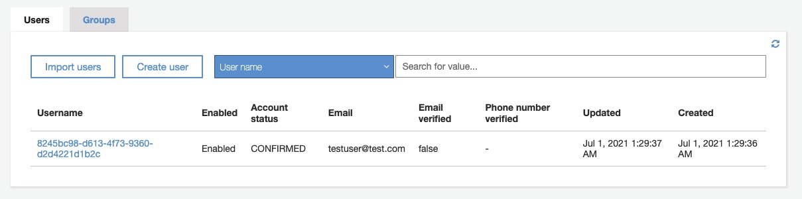

# ToDoリスト用REST API (AWS CDK) テスト

## 実行環境の準備

- Python >= 3.4
- [tavern](https://tavern.readthedocs.io/en/latest/index.html)
- [jq](https://stedolan.github.io/jq/)
- [aws cli v2](https://docs.aws.amazon.com/cli/latest/userguide/install-cliv2.html)

が動く環境を準備してください．

## 1. API Root URLの書き換え

SSMパラメータストアから，デプロイされたAPIのルートURLを確認して控えます．

```sh
aws ssm get-parameters --name "/cmtodoapi/prod/api/url" \
  --query "Parameters[*].{Value:Value}" | jq -r '.[]["Value"]'
```

[common.yaml](./common.yaml)の＜ルートURL＞の部分を，取得したURLに置き換えてください．

```yaml
name: テストの共通変数
description: テストの共通変数

variables:
  url:
    api: <ルートURL>/item # ここに取得したURLを記入
（以下続く）
```

## 2. 認証なしでアクセス拒否されることの確認

[test_unauthorized.tavern.yaml](./test_unauthorized.tavern.yaml)に，
認証なしでアクセス拒否されるテストケースを記載しています．

このケースでは，認証なしでAPIを使用したとき，レスポンスが401エラーとなることを確認します．

```sh
tavern-ci ./test_unauthorized.tavern.yaml
```

を実行し，テストが成功することを確認してください．

## 3. 認証用テストユーザの作成

次に，認証付きでのAPIテストのため，Cognito User Poolにユーザを作成します.

```sh
bash ./confirm_user.sh
```

を実行してユーザ作成とconfirmを実行してください.成功すると，

- username: testuser@test.com

のユーザが作成されます．



## 4. Cognito User Pool Client IDの取得とテスト変数への登録

```sh
bash ./get_client_id.sh
```

を実行し，[common.yaml](./common.yaml)の<Cognito User PoolのID>の部分を，
表示されたCliend Idに置換してください．

```yaml
name: テストの共通変数
description: テストの共通変数

variables:
  url:
    api: <ルートURL>/item
    cognito_idp: https://cognito-idp.ap-northeast-1.amazonaws.com/
  cognito_client: <Cognito User PoolのID> # ここを作成されたCliend Idに置換する
  authorized_user:
    username: "testuser@test.com"
    password: "Pass!-W0Rd"


```

## 5. 認証ユーザでのAPIのテスト

[test_authorized.tavern.yaml](./test_authorized.tavern.yaml)に，
認証ユーザでの，APIの全機能のテストケースを記載しています．

```sh
tavern-ci ./test_authorized.tavern.yaml
```

を実行し，テストが成功することを確認してください．

以上
